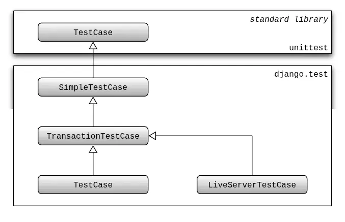

# Testing Views (Part 1) in Django

## 1. Core Concepts

- **Django Views:**
  Functions that process web requests and return responses. They receive a `request` object as a parameter. Simple views can render **HTML templates** using the `render` shortcut function.

- **URL Mapping:**
  Connecting a specific URL path to a Django view function. This is configured in `urls.py` files within your project or app. The `path()` function is used to define mappings.

- **Django Templates:**
  Files (typically HTML) that define the structure and content of the web response. A common practice is **template inheritance**, where templates extend a `base.html` file to reuse common structure (like boilerplate HTML), defining **content blocks** to insert unique page content.

- **Testing in Django:**
  Writing code to verify the behavior of different components of a Django application. This part of the series focuses on testing **views**.

- **Django Test Case Classes:**
  Specialized classes provided by Django for writing tests, building upon Python's standard `unittest.TestCase`. They offer Django-specific functionality. The hierarchy includes:

  

  - `unittest.TestCase` (Base Python class).
  - `SimpleTestCase` (Direct Django extension of `unittest.TestCase`).
  - `TransactionTestCase` (Extends `SimpleTestCase`).
  - `TestCase` (Most common; extends `TransactionTestCase`).
  - `LiveServerTestCase` (Extends `TransactionTestCase`).

- **`SimpleTestCase`:**
  A **Django test class** suitable for tests that **do not require database access**. It provides performance benefits by avoiding the setup and teardown of a test database and transactions for each test. It adds useful methods (like verifying URLs or redirects) and, crucially, provides access to the **Django Test Client**. Ideal for testing views that only render static content without querying the database.

- **`TestCase`:**
  The most commonly used Django test class. It **allows database access** and manages transactions (creates and rolls back a transaction for each test by default), ensuring tests are isolated. Use this when your view tests need to interact with the database.

- **Django Test Client:**
  A tool available within Django test case classes via `self.client`. It simulates making requests (like GET or POST) to your application's URLs directly in your test code, allowing you to inspect the **response**.

- **Django-Specific Test Assertions:**
  Methods provided by Django's test case classes to simplify common test checks on responses. Examples demonstrated:
  - `self.assertEqual(response.status_code, expected)`: Checks if the HTTP status code of the response matches the `expected` value (e.g., 200 for OK).
  - `self.assertTemplateUsed(response, 'template_name.html')`: Verifies that a specific template file was used when rendering the response.
  - `self.assertContains(response, 'text', status_code=200)`: Checks that the response content contains the specified `text`. It also **defaults to checking for a 200 OK status code**, potentially making a separate `assertEqual` for the status code redundant.

## 2. Resources

- [Testing in Django Tutorial #8 - Testing Views (part 1)](https://youtu.be/la69esudPYY?si=YgjWNpks6DUtkYK5)
- [Django Documentation - Provided Test Case Classes](https://docs.djangoproject.com/en/5.1/topics/testing/tools/#provided-test-case-classes)
- [Django Documentation - Assert Contains Method](https://docs.djangoproject.com/en/5.1/topics/testing/tools/#django.test.SimpleTestCase.assertContains)

## 3. Practical Steps: Hands-on Guide

1.  **Create a Simple View:**
    In your `views.py` file, define a function that takes `request` and uses `render` to return a template.

    ```python
    # products/views.py
    from django.shortcuts import render

    def homepage(request):
        return render(request, 'index.html')
    ```

2.  **Map a URL to the View:**
    In your project's `urls.py` file, add a path that points to your view.

    ```python
    # project/urls.py
    from django.contrib import admin
    from django.urls import path
    from products import views # Import your app's views

    urlpatterns = [
        path('admin/', admin.site.urls),
        path('', views.homepage, name='home'), # Map root URL to homepage view
    ]
    ```

3.  **Create Templates:**
    Create a `templates` directory in your app. Inside, create `base.html` and `index.html`.
    `base.html` (basic HTML structure with a content block):

    ```html
    {# products/templates/base.html #}
    <!DOCTYPE html>
    <html>
      <head>
        <title>My Store</title>
      </head>
      <body>
         
      </body>
    </html>
    ```

    `index.html` (extends base and adds content):

    ```html
    {# products/templates/index.html #}  
    <h1>Welcome to our store</h1>
    
    ```

4.  **Run the Server (Optional but Recommended):**
    Verify your view and template are working in a browser.

    ```bash
    python manage.py runserver
    ```

    Navigate to `localhost:8000` in your browser.

5.  **Create a Test File for Views:**
    In your app's `tests` directory, create a new file for view tests.

    ```bash
    # Inside your app's tests directory
    touch test_views.py
    ```

6.  **Import `SimpleTestCase`:**
    At the top of your `test_views.py` file, import `SimpleTestCase`.

    ```python
    # products/tests/test_views.py
    from django.test import SimpleTestCase
    # You might also need to import reverse later for robust URL testing
    # from django.urls import reverse
    ```

7.  **Create a Test Class:**
    Define a test class that inherits from `SimpleTestCase`.

    ```python
    # products/tests/test_views.py
    from django.test import SimpleTestCase

    class TestHomepage(SimpleTestCase):
        pass # Test methods will go here
    ```

8.  **Write a Test Method for Status Code (Initial Example):**
    Add a method to your test class. Test methods must start with `test_`. Use `self.client.get('/')` to make a GET request and `self.assertEqual` to check the status code.

    ```python
    # products/tests/test_views.py
    from django.test import SimpleTestCase

    class TestHomepage(SimpleTestCase):
        def test_homepage_status_code(self):
            response = self.client.get('/')
            self.assertEqual(response.status_code, 200)
    ```

9.  **Run Tests:**
    Execute tests from your project root. You can run all tests or target a specific test file.

    ```bash
    python manage.py test
    # Or specifically run view tests for the 'products' app
    python manage.py test products.tests.test_views
    ```

10. **Write a Test Method for Template Usage:**
    Add another method using `self.assertTemplateUsed` to check which template rendered the response.

    ```python
    # products/tests/test_views.py
    from django.test import SimpleTestCase

    class TestHomepage(SimpleTestCase):
        # ... (previous test method)

        def test_homepage_uses_correct_template(self):
            response = self.client.get('/')
            self.assertTemplateUsed(response, 'index.html')
    ```

11. **Write a Test Method for Content:**
    Add a method using `self.assertContains` to check for specific text within the response content.

    ```python
    # products/tests/test_views.py
    from django.test import SimpleTestCase

    class TestHomepage(SimpleTestCase):
        # ... (previous test methods)

        def test_homepage_contains_welcome_message(self):
            response = self.client.get('/')
            self.assertContains(response, 'Welcome to our store')
    ```

12. **Refactor using `assertContains`:**
    Since `assertContains` defaults to checking for a 200 status code, the separate `test_homepage_status_code` test can be removed as it becomes redundant, making tests slightly more performant. The test checking for the welcome message implicitly checks the status code. You can optionally make the status code check explicit in `assertContains`.

    ```python
    # products/tests/test_views.py
    from django.test import SimpleTestCase

    class TestHomepage(SimpleTestCase):
        # Removed test_homepage_status_code

        def test_homepage_uses_correct_template(self):
            response = self.client.get('/')
            self.assertTemplateUsed(response, 'index.html')

        def test_homepage_contains_welcome_message(self):
            response = self.client.get('/')
            self.assertContains(response, 'Welcome to our store', status_code=200) # Explicit status check
    ```

13. **Rerun Tests:**
    Execute tests again to confirm the new tests pass and the refactoring is correct.

    ```bash
    python manage.py test products.tests.test_views
    ```
